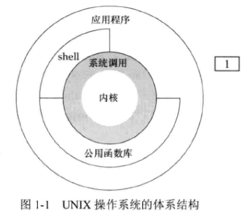

## 1 - UNIX基础知识

### 1. 操作系统

可将操作系统定义为一种软件，它控制计算机硬件资源，提供程序运行环境。通常将这种软件称为 **内核  (kernel)** 。（ **Linux** 是 **GNU** 操作系统的内核 ）

**内核** 的接口是 **系统调用 (system call)** ，**公用函数库** 构建在系统调用之上，应用程序既可以调用公用函数库，也可以使用系统调用。**shell** 是一个特殊的应用程序，为运行其他应用程序提供了一个接口。




### 2. shell

**shell** 是一个命令行解释器，它读取用户输入，然后执行命令。**shell** 的输入来自终端（交互式shell）或文件（shell脚本）。

### 3. 文件系统

**UNIX 文件系统** 是目录和文件的一种层次结构。

**目录 (dictionary)** 是一个包含目录项的文件。逻辑上，可以认为每个目录项都包含一个文件名，同时还包含说明该文件属性的信息。

目录中的每个文字称为 **文件名 (filename)** ，创建新目录时会自动创建了两个文件名：$.$ 和 $..$  ，点指向当前目录，点点指向父目录。在最高层次的根目录中，点点与点相同。

### 4. 输入和输出

**文件描述符 (file descriptor)** 通常是一个小的非负整数，内核用以标识一个特定进程正在访问的文件。每当运行一个新程序时，所有的shell都将为其打开3个文件描述符，**标准输入 (standard input)** 、**标准输出 (standard output)** 以及 **标准错误 (standard error)** 。

函数 `open` 、`read` 、`write` 、`lseek` 以及 `close` 提供了不带缓冲的 **I/O** 。这些函数都使用文件描述符。

**标准 IO 函数** 为不带缓冲的 IO函数提供了一个带缓冲的接口。在头文件 `stdio.h` 中定义。

### 5. 程序和进程

**程序 (program)** 是一个存储在磁盘上某个目录中的可执行文件。内核使用 `exec` 函数将程序读入内存。

程序的执行实例被称为 **进程** ，UNIX系统确保每个进程都有一个唯一的数字标识符，称为 **进程ID (process ID)** ，是一个非负整数。程序可调用 `getpid` 得到进程ID，返回一个 `pid_t` 的数据类型，标准会保证它保存在一个长整型中。

有3个用于进程控制的主要函数：`fork`、 `exec`、 `waitpid` 。

```c++
int main()
{
    char buf[MAXLINE];
    pid_t pid;
    int status;

    printf("%% ");
    while (fgets(buf, MAXLINE, stdin) != NULL) {
        if (buf[strlen(buf) - 1] == '\n')
            buf[strlen(buf) - 1] = 0;	//execlp命令的参数要以NULL结尾而不是换行符
        if ((pid = fork()) < 0) {
            cout << "fork error" << endl;
            exit(1);
        }
        else if (pid == 0) {
            execlp(buf, buf, (char *)0);
            cout << "couldn't execute: " << buf;
            exit(127);
        }
        if ((pid = waitpid(pid, &status, 0)) < 0) {
            cout << "waitpid error" << endl;
            exit(1);
        }
        printf("%% ");
    }
    exit(0);
}
```

- 调用 `fork` 创建一个新进程，被 **调用一次** ，调用进程为 **父进程** ，新创建的进程是 **子进程** （父进程的一个副本）；但 **返回两次** ，对父进程返回子进程的进程ID，对子进程返回 $0$ 。
- 子进程中，调用 `execlp` 执行从标准输入中读入的命令，这就用新的程序文件替换了子进程原先执行的程序文件。
- 父进程希望等待子进程终止，这是通过调用 `waitpid` 实现，`pid` 参数为子进程ID，`waitpid` 通过 `status` 的引用返回子进程终止状态，可用来判定子进程是如何终止的。

### 6.线程

一个进程只有一个 **控制线程 (thread)** ——某一时刻执行的一组机器指令。对于某些问题，如果有多个控制线程分别作用于它的不同部分，解决起来就容易很多；并且多个控制线程也可以充分利用多处理器系统的并行能力。

一个进程内的所有线程共享同一地址空间、文件描述符、栈以及进程相关的属性。因为它们能访问同一存储区，所以各线程在访问共享数据时需要采取同步措施以 **避免不一致性** 。

**线程ID** 只在它所属的进程内起作用。

### 7. 系统调用和库函数

各版本的UNIX实现都提供良好定义、数量有限、直接进入内核的入口点，这些入口点被称为 **系统调用 (system call)** ，Linux中，由C语言定义。

**通用库函数** 可能会调用一个或多个内核的系统调用，也可能不使用系统调用。

**系统调用** 和 **库函数** 都以C函数的形式出现，两者都为应用程序提供服务。从用户角度来看，两者区别并不重要。

两者的另一个 **区别** 是：系统调用通常提供一种最小接口，而库函数通常提供比较复杂的功能。


