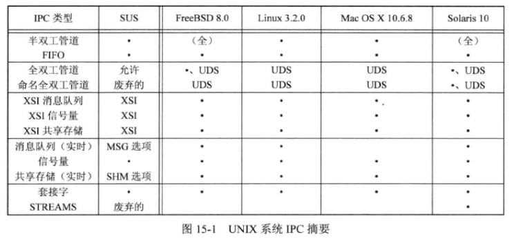

## 15 - 进程间通信

### 1. 进程间通信

**进程间通信 (IPC)** 是进程之间相互通信的技术：



前十种 **IPC** 形式通常限于同一台主机的两个进程之间的 **IPC** ，最后两行（ 套接字和 **STREAMS** ）是仅有的支持不同主机上两个进程之间的 **IPC** 的两种形式 。

### 2. 管道

**管道** 是 **UNIX** 系统 **IPC** 的最古老形式 。

管道的两种 **局限性**：

- 有的系统仅提供半双工通道
- 管道只能在具有公共祖先的两个进程之间使用 。通常，一个管道由一个进程创建，在进程调用 **fork** 之后，这个管道就能在父进程和子进程之间使用了

**管道在 shell 中执行规则**：每当在管道中键入一个命令序列，让 shell 执行，shell 都会为每一条命令单独创建一个进程，然后用管道将前一条命令进程的标准输出与后一条命令的标准输入相连接 。

管道是通过调用 **pipe** 函数 **创建** 的：

```c
#include <unistd.h>
int pipe(int fd[2]);
//返回值：若成功，返回 0；若出错，返回 -1
```

经由参数 $fd$ 返回两个文件描述符：$fd[0]$ 为读而打开，$fd[1]$ 为写而打开 。$fd[1]$ 的输出是 $fd[0]$ 的输入 。

单个进程中的管道几乎没有任何用处 。通常，进程会先调用 **pipe** ，接着 **fork** ，从而创建从父进程到子进程的 **IPC 通道** 。对于 **父进程到子进程的管道** ，父进程关闭管道的读端 $fd[0]$ ，子进程关闭写端 $fd[1]$ （如下图所示）。**子进程到父进程的管道** 反之 。


一个管道通常只有一个读进程和一个写进程 。

**当管道一端被关闭后** ，下列两条 **规则** 其作用：

- 当 **读一个 写端已被关闭的管道** 时，在所有数据都被读取后，**read** 返回 $0$ ，表示文件结束
- 当 **写一个读端已被关闭的管道** 时，则产生信号 `SIGPIPE` 。如果忽略该信号或者捕捉该信号并从其信号处理程序返回，则 **write** 返回 $-1$ ，**errno** 设置为 `EPIPE` 

### 3. 函数 popen 和 pclose

**popen** 函数的作用是：先执行 **fork** 创建子进程，然后调用 **exec** 执行 $cmdstring$ ，并且返回一个标准 I/O 文件指针 ：

```c
#include <stdio.h>
FILE *popen(const char *cmdstring, const char *type);
//返回值：若成功，返回文件指针；若出错，返回 NULL
```

如果 $type$ 是 `r` ，则文件指针连接到 $cmdstring$ 的标准输出（ 返回的文件指针是可读的 ）；若 $type$ 是`w` ，则文件指针连接到 $cmdstring$ 的标准输入（ 返回的文件指针是可写的 ）。


**pclose** 函数关闭标准 I/O 流，等待命令终止，然后返回 shell 的终止状态：

```c
#include <stdio.h>
int pclose(FILE *fp);
//返回值：若成功，返回 cmdstring 的终止状态；若出错，返回 -1
```

如果 shell 不能执行，则 **pclose** 返回值的终止状态与 shell 已经执行 **exit(127)** 一样 。

**用法举例**：`fp = popen("cmd 2>&1", "r");`


