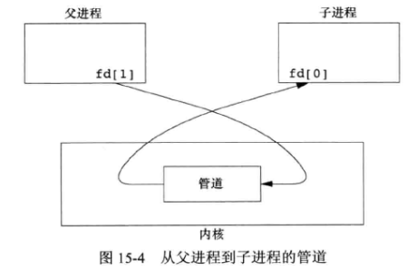
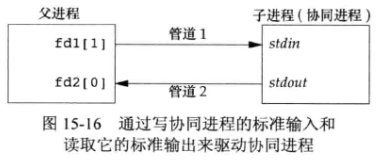
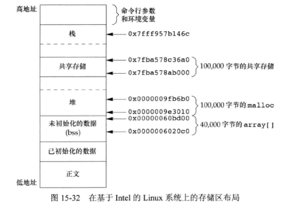

# 15 - 进程间通信

## 1. 进程间通信

**进程间通信 (IPC)** 是进程之间相互通信的技术：


前十种 **IPC** 形式通常限于同一台主机的两个进程之间的 **IPC** ，最后两行（ 套接字和 **STREAMS** ）是仅有的支持不同主机上两个进程之间的 **IPC** 的两种形式 。

## 2. 管道

### 2.1 管道概念

**管道** 是 **UNIX** 系统 **IPC** 的最古老形式 。

管道的两种 **局限性**：

- 有的系统仅提供半双工通道
- 管道只能在具有公共祖先的两个进程之间使用 。通常，一个管道由一个进程创建，在进程调用 **fork** 之后，这个管道就能在父进程和子进程之间使用了

**管道在 shell 中执行规则**：每当在管道中键入一个命令序列，让 shell 执行，shell 都会为每一条命令单独创建一个进程，然后用管道将前一条命令进程的标准输出与后一条命令的标准输入相连接 。

管道是通过调用 **pipe** 函数 **创建** 的：

```c
#include <unistd.h>
int pipe(int fd[2]);
//返回值：若成功，返回 0；若出错，返回 -1
```

经由参数 $fd$ 返回两个文件描述符：$fd[0]$ 为读而打开，$fd[1]$ 为写而打开 。$fd[1]$ 的输出是 $fd[0]$ 的输入 。

单个进程中的管道几乎没有任何用处 。通常，进程会先调用 **pipe** ，接着 **fork** ，从而创建从父进程到子进程的 **IPC 通道** 。对于 **父进程到子进程的管道** ，父进程关闭管道的读端 $fd[0]$ ，子进程关闭写端 $fd[1]$ （如下图所示）。**子进程到父进程的管道** 反之 。



一个管道通常只有一个读进程和一个写进程 。

**当管道一端被关闭后** ，下列两条 **规则** 其作用：

- 当 **读一个 写端已被关闭的管道** 时，在所有数据都被读取后，**read** 返回 $0$ ，表示文件结束
- 当 **写一个读端已被关闭的管道** 时，则产生信号 `SIGPIPE` 。如果忽略该信号或者捕捉该信号并从其信号处理程序返回，则 **write** 返回 $-1$ ，**errno** 设置为 `EPIPE` 

### 2.2. 函数 popen 和 pclose

**popen** 函数的作用是：先执行 **fork** 创建子进程，然后调用 **exec** 执行 $cmdstring$ ，并且返回一个标准 I/O 文件指针 ：

```c
#include <stdio.h>
FILE *popen(const char *cmdstring, const char *type);
//返回值：若成功，返回文件指针；若出错，返回 NULL
```

如果 $type$ 是 `r` ，则文件指针连接到 $cmdstring$ 的标准输出（ 返回的文件指针是可读的 ）；若 $type$ 是`w` ，则文件指针连接到 $cmdstring$ 的标准输入（ 返回的文件指针是可写的 ）。


**pclose** 函数关闭标准 I/O 流，等待命令终止，然后返回 shell 的终止状态：

```c
#include <stdio.h>
int pclose(FILE *fp);
//返回值：若成功，返回 cmdstring 的终止状态；若出错，返回 -1
```

如果 shell 不能执行，则 **pclose** 返回值的终止状态与 shell 已经执行 **exit(127)** 一样 。

**用法举例**：`fp = popen("cmd 2>&1", "r");`

### 2.3. 协同进程

**过滤程序** 从标准输入读取数据，向标准输出写数据，几个过滤程序通常在 shell 管道中线性连接 。当一个过滤程序既产生某个过滤程序的输入，又读取该过滤程序的输出时，它就变成了 **协同进程** 。



## 3. FIFO

**FIFO** 有时被称为 **命名管道** 。未命名的管道只能在两个相关的进程之间使用，而且这两个相关进程还要有一个共同创建了它们的祖先进程 。但是，通过 **FIFO** ，**不想关的进程也能交换数据** 。

**FIFO** 是一种文件类型，创建 **FIFO** 类似于创建文件：

```c
#include <sys/stat.h>
int mkfifo(const char *path, mode_t mode);
int mkfifoat(int fd, const char *path, mode_t mode);
//返回值：若成功，返回 0；若出错，返回 -1
```

**mkfifo** 函数中的 $mode$ 参数的规格说明与 **open** 函数中 $mode$ 的相同 。**mkfiat** 函数可以被用来在 $fd$ 文件描述符表示的目录相关的位置创建一个 **FIFO** 。

当用 **mkfifo** 或者 **mkfifoat** 创建 **FIFO** 时，要用 **open** 来打开它，当 **open** IPC一个 **FIFO** 时，非阻塞标志（ `O_NONBLOCK` ）会产生下列影响：

- 在一般情况下（没有指定 `O_NONBLOCK` ），只读 **open** 要阻塞到某个进程为写而打开这个 **FIFO** 为止 。类似地，只写 **open** 要阻塞到某个其他进程为读而打开它为止
- 如果指定了 `O_NONBLOCK` ，则只读 **open** 立即返回 。但是，如果没有进程为读而代开一个 **FIFO** ，那么只写 **open** 将返回 $-1$ ，并将 **errno** 设置成 `ENXIO` 

一个给定的 **FIFO** 有多个写进程是常见的，如果不希望多个进程所写的数据交叉，则必须考虑 **原子写操作** 。和管道一样，`PIPE_BUF` 说明了可被原子地写到 **FIFO** 的最大数据量 。

**FIFO** 有以下两种用途：

- **shell** 命令使用 **FIFO** 将数据从一条管道传送到另一条时，无需创建临时文件
- **客户进程-服务器进程** 应用程序中，**FIFO** 用作汇聚点，在客户进程和服务器进程二者之间传递数据

## 4. XSI IPC

有 $3$ 种称作 **XSI IPC** 的 **IPC** ：消息队列、信号量以及共享存储器 。

每个 **内核中** 的 **IPC** 结构（消息队列、信号量或者共享存储段）都用一个非负整数的 **标识符** 加以引用 。如：要向一个消息队列发送消息或者从一个消息队列去消息，只需要知道其队列标识符 。

**标识符** 是 IPC对象 的内部名 。为使多个合作进程能够在同一 IPC对象上汇聚，需要提供一个外部命名方案 。为此，每个IPC对象都与一个 **键** 相关联，将这个键作为该对象的外部名 。无论何时创建 **IPC结构**（通过调用 **msgget** 、**semget** 或 **shmget** 创建），都应指定一个键 ，这个键由内核编程标识符 。

使 **客户进程和服务进程在同一 IPC 结构上汇聚** 的方法：

- 服务器进程可以指定键 `IPC_PRIVATE` 创建一个新 **IPC** 结构，将返回的标识符存放在某处（ 如一个文件 ）以便客户进程取用 。缺点是：文件系统操作需要服务器进程将整型标识符写到文件中，此后客户进程又要读这个文件取得此标识符
- 客户进程和服务器进程认同一个 **路径名** 和 **项目ID (0~255之间的字符值)** ，接着调用 **ftok** 将这两个值变换为一个 **键** ，然后服务器进程特定此键创建一个新的 **IPC 结构** 。

**ftok** 函数作用为：由一个路径名和项目 ID 产生一个键：

```c
#include <sys/ipc.h>
key_t ftok(const char *path, int id);	
//path必须引用一个现有文件；当产生键时，只使用id参数的低 8 位
//返回值：若成功，返回键；若出错，返回 -1
```

$3$ 个 **get** 函数（ **msgget** 、**semget** 和 **shmget** ）都有两个类似的参数：一个 $key$ 和一个整型 $flag$ ，规则为：

- **在创建新的 IPC 结构**（通常由服务器进程创建）时。如果 $key$ 是 `IPC_PRIVATE` 或者和当前某种类型的 IPC 结构无关，则需要指明 $flag$ 的 `IPC_CREAT` 标志位
- **为了引用一个现有队列**（通常由客户进程创建），$key$ 必须等于队列创建时指明的 $key$ 值，并且 `IPC_CREAT` 必须不被指明

**XSI IPC 的缺点** 为：

1. IPC结构是在系统范围内起作用的，没有引用计数 。例如：如果进程创建了一个消息队列，并且在该队列中放入了几则消息，然后终止，那么该消息队列及其内容不会被删除
2. 这些 IPC 结构在文件系统中没有名字，为支持这些 IPC对象，内核中增加了十几个全新的系统调用来访问它们或者修改它们的属性
3. 因为这些形式的 IPC 不适用文件描述符，所以不能对他们使用多路转接 I/O 函数（select 和 epoll ），这使得它很难一次使用一个以上这样的 IPC结构，或者在文件或设备 I/O 中使用这样的 IPC结构

**XSI IPC 的优点** 为：它们是可靠的、流控制的以及面向记录的；它们可以用非先进先出次序处理 。

**流控制** 的意思是：如果系统资源（如缓冲区）短缺，或者如果接收进程不能再接收更多消息，则发送进程就要休眠；当流控制条件消失时，发送进程应自动唤醒 。

### 4.1 消息队列

**消息队列** 是消息的链接表，存储在内核中，由 **消息队列标识符** 标识 。

**msgget** 用于创建一个新队列或打开一个现有队列：

```c
#include <sys/msg.h>
int msgget(key_t key, int flag);
//返回值：若成功，返回消息队列 ID；若出错，返回 -1
```

**msgctl** 函数对队列执行多种操作（ 取队列的 **msqid_ds** 结构、删除消息队列等 ）：

```c
#include <sys/msg.h>
int msgctl(int msqid, int cmd, struct msqid_ds *buf);
//返回值：若成功，返回 0；若出错，返回 -1
```

调用 **msgsnd** 将数据放到消息队列中：

```c
#include <sys/msg.h>
int msgsnd(int msqid, const void *ptr, size_t nbytes, int flag);
//返回值：若成功，返回 0；若出错，返回 -1
```

每个消息由 $3$ 部分组成：一个正的长整型类型的字段、一个非负的长度（ $nbytes$ ）以及实际数据字节数（对应于长度）。消息总是放在队列尾端 。

$ptr$ 参数指向一个长整型数，它包含了正的整型消息类型，其后紧接着的是消息数据（ 若 $nbytes$ 是 $0$ ，则无消息数据 ）的缓冲区。

**msgrcv** 从队列中取用消息：

```c
#include <sys/msg.h>
ssize_t msgrcv(int msqid, void *ptr, size_t nbytes, long type, int flag);
//返回值：若成功，返回消息数据部分的长度；若出错，返回 -1
```

接收者可以使用消息类型以非先进先出的次序取消息（ $type \not= 0$ ） 。

**msgsnd** 和 **msgrcv** 成功执行时，内核会更新与该消息队列相关联的 **msgid_ds** 结构 。

**应用**：如若需要客户进程和服务器进程之间的双向数据流，可以使用消息队列或全双工管道 。

**缺点**：对删除队列的处理不是很完善。因为每个消息队列没有维护引用计数器，所在队列被删除后，仍在使用这一队列的进程在下次对队列进行操作时会出错返回 。

**注意**：消息队列与其他形式 **IPC** 相比，速度方面没什么差别，考虑到使用消息队列时遇到的问题，在 **新的应用程序中不应当再使用它们** 。

### 4.2 信号量

**信号量** 是一个计数器，用于为多个进程提供对共享数据对象的访问 。信号量通常在内核中实现 。

信号量 **实际上是同步原语而不是 IPC** ，常用于共享资源（如共享存储段）的同步访问 。

**对于共享资源的获取和释放** ，进程需要执行下列操作：

1. 测试控制该资源的信号量
2. 若此信号量的值为正，则进程可以使用该资源 。这种情况下，进程会将信号量值减 $1$ ，表示它使用了一个资源单位
3. 否则，若此信号量的值为 $0$ ，则进程进入休眠状态，直至信号量值大于 $0$ 。进程被唤醒后，返回步骤 $(1)$ 
4. 当进程不再使用由一个信号量控制的共享资源时，该信号量值增 $1$ 。如果有进程正在休眠等待此信号量，则唤醒它们

内核为每个 **信号量集合** 维护着一个 **semid_ds** 结构：

```c
struct semid_ds {
    struct ipc_perm sem_perm;	//规定权限和所有者
    unsigned short sem_nsems;	//集合中信号量的编号
    time_t sem_otime;			
    time_t sem_ctime;
    //...
};
```

**每个信号量** 由一个无名结构表示，它至少包含下列成员：

```c
struct {
    unsigned short semval;	//信号量的值，>= 0
    pid_t sempid;			//上次操作的 pid
    unsigned short semncnt;	//semncnt 个进程在等待 semval > curval (curval为sembuf中的sem_op)
    unsigned short semzcnt;	//semzcnt 个进程在等待 semval == 0
};
```

要使用 **XSI 信号量** 时，首先需要通过调用函数 **semget** 来获得一个 **信号量 ID** ：

```c
#include <sys/sem.h>
int semget(key_t key, int nsems, int flag);
//返回值：若成功，返回信号量ID；若出错，返回 -1
```

$key$ 参数决定了是创建一个新集合，还是引用一个现有集合 。

$nsems$ 是该集合中的信号量数 。如果是创建新集合（一般在服务器进程中），则必须指定 $nsems$ 。如果是引用现有集合（一个客户进程），则将 $nsems$ 指定为 $0$ 。

**semctl** 函数包含了多种信号量操作：

```c
#include <sys/sem.h>
int semctl(int semid, int semmum, int cmd, .. /* union semun arg */);
```

$semid$ 为信号量集合 ID， $cmd$ 指定函数功能，$semmum$ 指定该信号量集合中的一个成员 。

此函数包含了删除信号量集合、获取集合 **semid_ds** 结构、设置 **sem_perm** 属性 、返回信号量各属性等功能 。

函数 **semop** 自动执行信号量集合上的操作数组：

```c
#include <sys/sem.h>
int semop(int semid, struct sembuf semoarray[], size_t nops);
//返回值：若成功，返回 0；若出错，返回 -1
```

参数 $semoarray$ 是一个指针，它指向一个由 **sembuf** 结构表示的 **信号量操作数组** ：

```c
struct sembuf {
    unsigned short sem_num;	// 信号量集合中的编号
    short sem_op;			// 操作，正数值、负数值、0
    short sem_flg;			// IPC_NOWAIT, SEM_UNDO
};
```

$nops$ 规定该数组中操作的数量（ 元素数 ）。

$sem\_flg$ 中，`IPC_NOWAIT` 用于指定函数是否阻塞 ；若对信号量操作设了 `SEM_UNO` ，然后分配资源（ **sem\_op** 值小于 $0$ ），那么内核就会记住对于该特定信号量，分配给调用进程多少资源（ **sem\_op** 的绝对值 ）。当该进程终止时，内核将检验该进程是否还有尚未处理的 **信号量调整值** ，如果有，则按调整值对相应信号量值进行处理 。

**对集合中每个成员的操作** 由 $sem\_op$ 规定，此值可以是负值、$0$ 或正值 ：

- 若为 **正值** ，对应于进程释放的占用的资源数 。$sem\_op$ 值会加到信号量的值上 。如果指定了 $undo$ 标志，则也从该进程的此信号量调整值中减去 $sem\_op$ 。
- 若为 **负值** ， 对应于进程获取由该信号量控制的资源 。 若信号量的值大于等于 $sem\_op$ 的绝对值，则从信号量值中减去 $sem\_op$ 的绝对值 。若指定了 $undo$ 标志，此信号量调整值加上 $sem\_op$ 的绝对值 。
- 若为 $0$ ，表示调用进程希望等待到该信号量值变成 $0$ 。

**信号量常规使用方法**：使用 **semget** 创建一个信号量集合，使用 **semctl** 将信号量值初始化为 $1$ 。为了分配资源，以 **sem\_op** 为 $-1$ 调用 **semop** ；为释放资源，以 **sem\_op** 为 $1$ 调用 **semop** 。对每个操作都指定 `SEM_UNDO` ，以处理在未释放资源条件下进程终止的情况 。

###  4.3 共享存储

**共享存储** 允许两个或多个进程共享一个给定的存储区 。因为数据不需要在客户进程和服务器进程之间复制，所以这是 **最快** 的一种 IPC 。使用共享存储区，要在多个进程之间 **同步** 访问一个给定的存储区 。通fanhui常，**信号量** 用于同步共享存储访问 。

**XSI** 共享存储和内存映射的文件的不同之处在于，前者没有相关的文件 。**XSI 共享存储段** 是内存的匿名段 。

内核为每个 **共享存储段** 维护着一个结构：

```c
struct shmid_ds {
    struct ipc_perm shm_perm;	// 规定权限和所有者
    size_t shm_segsz;			// size of segment in bytes
    pid_t shm_lpid;				// pid of last shmop
    pid_t shm_cpid;				// pid of creator
    shmatt_t shn_nattch;		// 共享存储段的连接计数
    time_t shm_atime;			// last-attach time
    time_t shm_dtime;			// last-detach time
    time_t shm_ctime;			// last-change time
    //...
};
```

**shmget** 函数用于 **获得一个共享存储标识符**：

```c
#include <sys/shm.h>
int shmget(key_t key, size_t size, int flag);
//返回值：若成功，返回共享存储 ID；若出错，返回 -1
```

$key$ 参数指明是创建一个新共享存储段，还是引用一个现有的共享存储段 。

$size$ 参数是该共享存储段的长度，以字节为单位，通常将其向上取为系统页长的整数倍 。如果正在创建一个新段（通常在服务器进程中），则必须指定其 $size$ 。如果正在引用一个现存的段（一个客户进程），则将 $size$ 指定为 $0$ 。当创建一个新段时，段内的内容初始化为 $0$ 。

**shmctl** 函数对共享存储段执行 **多种操作**：

```c
#include <sys/shm.h>
int shmctl(int shmid, int cmd, struct shmid_ds *buf);
//返回值：若成功，返回 0；若出错，返回 -1
```

$cmd$ 参数指定了对于段的操作，包括：取此段的 **shmid_ds** 结构、设置 **shmid_ds** 字段、从系统中删除共享存储段、在内存中对共享存储段加锁 、解锁共享存储段（最后两个命令只能由超级用户执行） 等 。

进程调用 **shmat** 将共享存储段 **连接到它的地址空间中**：

```c
#include <sys/shm.h>
void *shmat(int shmid, const void *addr, int flag);
//返回值：若成功，返回指向共享存储段的指针；若出错，返回 -1
```

若 $addr$ 为 $0$ ，则此段连接到由内核选择的第一个可用地址上，这是推荐的方式 。若不为 $0$ ，结合 $flag$ 参数的 `SHM_RND` 可指定连接地址 。

如果在 $flag$ 中指定了 `SHM_RDONLY`  位，以只读方式连接此段，否则以读写方式连接此段 。

如果 **shmat** 成功执行，那么内核将使与该共享存储段相关的 **shmid_ds** 结构中的 **shm_nattch** 计数器加 $1$ 。进程可以对函数返回指针指向的地址进行读或写操作 。

**进程连接共享存储段之后的存储区示意图**：



当对共享存储段的操作已经结束时，调用 **shmdt** 与该段 **分离**：

```c
#include <sys/shm.h>
int shmdt(const void *addr);
//返回值：若成功，返回 0；若出错，返回 -1
```

$addr$ 参数是以前调用 **shmat** 时的返回值 。如果成功，**shmdt** 将使相关 **shmid_ds** 结构中的 **shm_nattch** 计数器值减一 。

**注意**：这并不从系统中删除其标识符以及相关的数据结构 。该标识符仍然存在，直至某个进程（一般是服务器进程）带 `IPC_RMID` 命令的调用 **shmctl** 特地删除它为止 。

## 5. POSIX 信号量

**POSIX** 信号量意在解决 **XSI 信号量** 的几个缺陷：

- **POSIX** 信号量新能更高
- **POSIX** 信号量接口使用更简单（没有信号量集），会使用文件系统进行实现，一些接口被模式化
- **POSIX** 信号量在删除时表现更完美 。当一个 **XSI** 信号量被删除时，使用这个信号量标识符的操作会失败，并将 **errno** 设置成 `EIDRM` 。而使用 **POSIX** 信号量时，操作能继续正常工作直到该信号量的最后一次引用被释放

**命名信号量** 和 **未命名的信号量**（差异在于创建和销毁形式）：

- **未命名信号量**：只存在与内存中，并要求能使用信号量的进程必须可以访问内存。（ 这意味着它只能应用在同一进程的线程中，或者不同进程中已经映射相同内存内容到它们的地址空间中的线程 ）

- **命名信号量**：可以通过名字访问，因此可以被任何已知它们名字的进程中的线程使用

### 5.1 命名信号量

调用 **sem_open** 函数来 **创建一个新的命名信号量** 或者 **使用一个现有信号量**：

```c
#include <semaphore.h>
sem_t *sem_open(const char *name, int oflag, ... /* mode_t mode, unsigned int value*/);
//返回值：若成功，返回指向信号量的指针；若出错，返回 SEM_FAILED
```

完成信号量操作时，可以调用 **sem_close** 函数来 **释放任何信号量相关的资源**：

```c
#include <semaphore.h>
int sem_close(sem_t *sem);
//返回值：若成功，返回 0；若出错，返回 -1
```

如果进程没有首先调用 **sem_close** 而退出，那么内核将自动关闭任何打开的信号量 。这不会影响信号值量的状态 。类似地，如果调用 **sem_close** ，信号值也不会受影响 。

可以使用 **sem_unlink** 函数来 **销毁** 一个命名信号量：

```c
#include <semaphore.h>
int sem_unlink(const char *name);
//返回值：若成功，返回 0；若出错，返回 1
```

**sem_unlink** 函数删除信号量的名字 。如果没有打开的信号量引用，额该信号量会被销毁 。否则，销毁将延迟到最后一个打开的引用关闭 。

**区别**：**sem_unlink** 是解除进程和信号量的关联；**sem_close** 是释放信号量相关资源 。

可以使用 **sem_wait** 、 **sem_trywait** 和 **sem_timewait** 实现信号量的 **减一** 操作：

```c
#include <semaphore.h>
int sem_wait(sem_t *sem);	//若果信号量为 0，阻塞，直到成功将信号量减一或被信号中断
int sem_trywait(sem_t *sem);	//若信号量是 0，不阻塞，直接返回 -1
int sem_timedwait(sem_t *retrict sem, const struct timespec *restrict tsptr);
//若信号量是 0，阻塞一段时间，tsptr为绝对时间
//三个函数返回值：若成功，返回 0；若出错，返回 -1
```

调用 **sem_post** 函数使信号量值 **增一** ：

```c
#include <semaphore.h>
int sem_post(sem_t *sem);
//返回值：若成功，返回 0；否则，返回 -1
```

### 5.2 未命名信号量

如果想在 **单个进程** 中使用 **POSIX 信号量** 时，使用未命名信号量更容易 。这仅仅改变创建和销毁信号量的方式 。

可以调用 **sem_init** 函数来 **创建一个未命名的信号量**：

```c
#include <semaphore.h>
int sem_init(sem_t *sem, int pshared, unsigned int value);
//返回值：若成功，返回 0；若出错，返回 -1
```

需要声明一个 **sem_t** 类型的变量并把它的地址传递给 **sem_init** 来实现初始化 。如果在两个进程之间使用信号量，需要确保 $sem$ 参数指向两个进程之间共享的内存范围 。

对未命名信号量的使用已经完成时，可以调用 **sem_destroy** 函数 **丢弃** 它：

```c
#include <semaphore.h>
int sem_destroy(sem_t *sem);
//返回值：若成功，返回 0；若出错，返回 -1
```

**sem_getvalue** 函数可以用来检索信号量值：

```c
#include <semaphore.h>
int sem_getvalue(sem_t *restrict sem, int *restrict valp);
//返回值：若成功，返回 0；若出错，返回 -1
```

## 6. 几种 IPC 的应用

- **管道** 和 **FIFO** 仍可有效应用于大量的应用程序
- 新的应用程序中，应尽可能 **避免使用 消息队列 和 信号量** ，而应考虑使用 **全双工管道** 和 **记录锁** ，它们使用起来更方便
- 共享存储仍有它的用途，虽然通过 **mmap** 函数也能提供同样的功能


