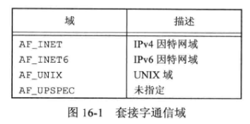

# 16 - 网络IPC:套接字

## 1. 网络 IPC

**经典进程间通信机制** （ **IPC** ）：管道、**FIFO** 、消息队列、信号量和共享存储，允许在同一台计算机上运行的进程之间通信 。

**网络进程间通信** 是不同计算机（通过网络连接）上的进程相互通信的机制 。（也可用于计算机内通信）

## 2. 套接字描述符

**套接字** 是通信端点的抽象，应用程序用 **套接字描述符** 访问套接字 。套接字描述符在 UNIX 系统中被当作是一种文件描述符 。

使用 **socket** 函数 **创建** 一个套接字：

```c
#include <sys/socket.h>
int socket(int domain, int type, int protocol);
//返回值：若成功，返回套接字描述符；若出错，返回 -1
```

参数 $domain$ （ 域 ）确定通信的特性，表示各个域的常数都以 `AF_` 开头，意指 **地址族**：



参数 $type$ 确定套接字的类型，进一步确定通信特征：


参数 $protocol$ 通常是 $0$ ，表示为给定的域和套接字类型选择默认协议 。当对同一域和套接字类型支持多个协议时，使用 $protocol$ 选择一个特定协议 ：


`AF_INET` 通信域中，套接字类型 `SOCK_STREAM` 默认协议是 **TCP** ，要求在交换数据之前，在本地和通信的对等进程之间建立一个 **逻辑连接** ，提供面向连接的字节流服务 ；套接字类型 `SOCK_DGRAM` 默认协议是 **UDP** ，两个对等进程之间通信时不需要逻辑连接 。

**流控制传输协议 (SCTP)** 提供了因特网域上的顺序数据包服务。（ `SOCK_SEQPACKET` ）

`SOCK_RAW` 套接字提供一个数据报接口，用于直接访问下面的 **网络层 ( IP层 )** 。使用这个接口时，应用程序负责构造自己的协议头部 。

不再需要套接字时，使用 **close** 函数 **关闭对套接字的访问** ，并且释放该描述符以便重新使用 。

套接字通信是双向的 ，可以采用 **shutdown** 函数来禁止一个套接字的 **I/O**：

```c
#include <sys/socket.h>
int shutdown(int sockfd, int how);
//返回值：若成功，返回 0；若出错，返回 -1
```

如果 $how$ 是 `SHUT_RD` （关闭读端），那么无法从套接字读取数据；如果 $how$ 是 `SHUT_WR` （关闭写端），那么无法使用套接字发送数据 ；如果 $how$ 是 `SHUT_RDWR` ，则既无法读取数据，又无法发送数据 。

**使用 shutdown 的原因**：

- 只有最后一个文件描述符引用被关闭时，**close** 才释放网络端点；而 **shutdown** 允许使一个套接字处于不活动状态，和引用它的文件描述符数目无关
- 可以很方便地关闭套接字双向传输中的一个方向

## 3. 寻址


  


