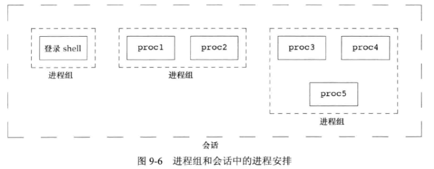
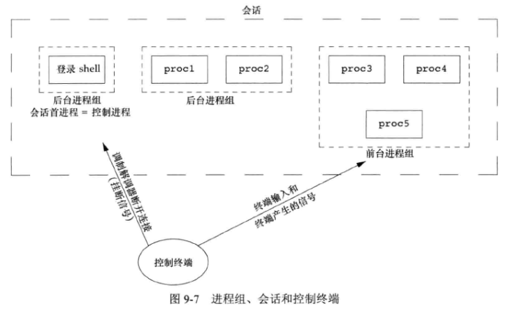
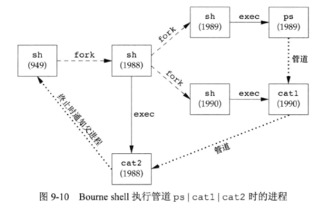

## 9 - 进程关系

### 1. 进程组

每个进程除了有一个 **进程 ID** 外，还属于一个 **进程组** 。进程组是一个或多个进程的 **集合** ，通常，它们是在同一作业中结合起来的，同一进程组中的各进程接受来自同一终端的各种信号。每一个进程组有一个唯一的 **进程组 ID** 。

函数 **getpgrp** 返回调用进程的进程组 ID：

```c++
#include <unistd.h>
pid_t getpgrp(void);	//返回值：调用此函数的进程的进程组ID
```

函数 **getpgid** 用于获取指定 $pid$ 进程的进程组 ID：

```c++
#include <unistd.h>
pid_t getpgid(pid_t pid);	//返回值：若成功，返回进程组ID；若出错，返回-1
```

**getpgid(0)** 等价于 **getpgrp()** 。

每个进程有一个 **组长进程** ，组长进程的进程组 ID ，等于其进程 ID 。进程组组长可以创建一个进程组、创建该组中的进程，然后终止。只要在某个进程组中有一个进程存在，则该进程组就存在，与组长进程是否终止无关。从进程组创建开始到其中最后一个进程离开为止的时间区间称为 **进程组的生命期** 。

进程调用 **setpgid** 可以加入一个现有的进程组或创建一个新进程组：

```c++
#include <unistd.h>
int setpgid(pid_t pid, pid_t pgid);	//返回值：若成功，返回0,；若出错，返回-1
```

- **setpgid** 将 $pid$ 进程组ID 设置为 $pgid$ 
- 如果这两个参数相等，则由 $pid$ 指定的进程变成进程组组长
- 如果 $pid$ 是 $0$ ，则使用调用者的进程ID
- 如果 $pgid$ 是 $0$ ，则由 $pid$ 指定的 进程ID 用作 进程组ID

一个进程只能为 **它自己或它的子进程** 设置进程组ID。在它的子进程调用 **exec** 后，它就不再更改该子进程的进程组 ID。

### 2. 会话

**会话 (session)** 是一个或多个进程组的集合。通常是shell的 **管道** 将几个进程编成一组的。



进程调用 **setsid** 函数建立一个新会话：

```c++
#include <unistd.h>
pid_t setsid(void);	//返回值：若成功，返回进程组ID；若出错，返回-1.
```

- 如果调用此函数的进程不是一个进程组的组长，则此函数会创建一个新会话。具体会发生：
  1. 该进程编成新会话的 **会话首进程 (会话首进程是创建该会话的进程)** ，此时，该进程是新会话中的唯一进程。
  2. 该进程成为一个新进程组的组长进程。新进程组ID是该调用进程的进程 ID。
  3. 该进程没有控制终端。如果在调用 **setsid** 之前该进程有一个控制终端，那么这种联系也被切断。
- 如果该调用进程已经是一个进程组的组长，则此函数返回出错。

**getsid** 函数返回 **会话首进程的进程组ID (可理解为会话ID)**：

```c++
#include <unistd.h>
pid_t getsid(pid_t pid);	//返回值：若成功，返回会话首进程的进程组ID；若出错，返回-1
```

若 $pid=0$ ，**getsid** 返回 **调用进程** 的会话首进程的进程组ID 。

**getsid** 函数有如下限制：若 $pid$ 并不属于调用者所在的会话，那么调用进程就不能得到该会话首进程的进程组ID 。

### 3. 控制终端



- 一个会话可以有一个 **控制终端** 。这通常是终端设备（在终端登录情况下）或伪终端设备（在网络登录情况下）。
- 建立与控制终端连接的会话首进程被称为 **控制进程** 。
- 一个会话中的几个进程可被分成一个 **前台进程组** 以及一个或多个 **后台进程组** 。
- 如果一个会话有一个控制终端，则它有一个前台进程组，其他进程组为后台进程组。
- 无论何时键入终端的 **中断键** ，都会将 **中断信号** 发送至前台进程组的所有进程 。
- 无论何时键入终端的 **退出键** ，都会将退出信号发送至前台进程组的所有进程。
- 如果终端接口检测到调制解调器（或网络）已经断开连接，则将挂断信号发送至 **控制进程**（会话首进程）

 ### 4. 函数 tcgetpgrp、tcsetpgrp 和 tcgetsid

```c++
#include <unistd.h>
pid_t tcgetpgrp(int fd);	//返回值：若成功，返回前台进程组ID；若出错，返回-1
int tcsetpgrp(int fd, pid_t pgrpid);	//返回值：若成功，返回0；若出错，返回-1
#inlcude <termios.h>
pid_t tcgetsid(int fd);	//返回值：若成功，返回会话首进程的进程组ID；若出错，返回-1
```

$fd$ 为 **控制终端的文件描述符** 。

**tcsetpgrp** 函数将前台进程组ID设置为 $pgrpid$ 。$pgrpid$ 值应当是在同一会话中的一个进程组的 ID。

### 5. 作业控制

一个 **作业** 即一个进程组。UNIX 允许在一个终端上启动多个作业（进程组），它控制哪一个作业可以访问该终端以及哪些作业在后台运行。

**&** 放在命令后面表示设置此进程为后台进程。当启动一个后台作业时，shell 赋予它一个作业标识符，并打印一个或多个进程 ID。

有 $3$ 个 **特殊字符** 可使终端驱动程序产生信号，并将它发送至前台进程组：

- 中断字符（一般采用 Delete 或 Ctrl+C ）产生 `SIGINT`
- 退出字符（一般采用 Ctrl+\ ）产生 `SIGQUIT`
- 挂起字符（一般采用 Ctrl+Z ）产生 `SIGTSTP`

**fg** 命令可将后台作业转为前台作业，如：`fg %1` 。

### 6. shell 执行程序

对于使用了 **管道** 的命令，该管道中的 **最后一个进程是 shell 的子进程** ，而执行管道中 **其他命令的进程则是该最后进程的子进程** 。

如：`ps -o pid,ppid | cat1 | cat2` ，**cat2** 是 shell 的子进程，**cat1** 和 **ps** 是 **cat2** 的子进程。



### 7. 孤儿进程组

**定义** 为：该组中每个成员的父进程要么 **是该组的一个成员** ，要么 **不是该组所属会话的成员** 。

**一个进程组不是孤儿进程组的条件是**：该组中有一个进程，其父进程在属于 **同一会话** 的 **另一个组** 中。如果进程组不是孤儿进程组，那么在属于同一会话的另一个组中的父进程就有机会重新启动该组中停止的进程。


 


